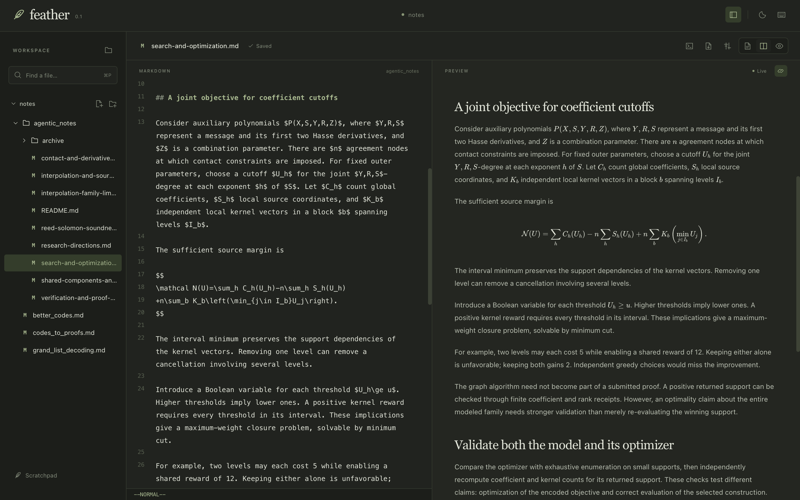

<p align="center">
  
</p>
<h1 align="center">Feather</h1>
<p align="center">A minimal editor for Markdown and LaTeX.</p>

Built with Rust and Tauri. Local files. No accounts or telemetry.



## Features

- Live Markdown, math, and LaTeX/PDF preview.
- Built-in Rust, TypeScript, Python, and Lean code highlighting; unknown languages use C.
- Autosave, file explorer, and quick open.
- Feather, GitHub, and Midnight profiles; light/dark themes and Zen mode.
- Resizable panes and interface zoom.
- Optional Vim keybindings.
- Editable Git diff and a Bash terminal (Ctrl + backtick).
- Save Markdown and LaTeX directly to PDF.
- Open files or folders with `feather .`.
- Built-in feature guide with Markdown, math, and LaTeX examples.

Try the [demo folder](demo/README.md): `cd demo && feather .` from the repository root.

## Install on macOS

Paste into Terminal:

```bash
/bin/bash -c "$(curl -fsSL https://raw.githubusercontent.com/partylikeits1983/feather/main/scripts/install-macos.sh)"
```

[The script](scripts/install-macos.sh) installs missing tools through Homebrew, clones this repository, and builds Feather on your Mac. It installs `~/Applications/Feather.app`, adds its icon to your Desktop, and opens it. No prebuilt app download or Apple developer account needed.

The first build takes a few minutes. macOS/Homebrew may ask you to install Command Line Tools or enter your password.

The `feather` command is installed in `~/.local/bin`; add that folder to your PATH if needed. Standard LaTeX packages are prepared during installation. For additional packages, run `tectonic your-paper.tex` once.

## Update

Quit Feather, then run in macOS Terminal:

```bash
~/.local/bin/feather update
```

Or rerun the install command above. Both pull the latest source, rebuild, replace the old app, and reopen Feather. Your files and settings stay intact. With `~/.local/bin` on PATH, use `feather update`.

[Manual builds, testing, and Windows/Linux setup →](docs/DEVELOPMENT.md)
